# Spring boot tutorial

Đây là kho lưu trữ quá trình học **Spring boot** của tôi, dựa trên [tutorial](https://www.javatpoint.com/spring-boot-tutorial) của Javapoint. Repository này sẽ được chỉnh sửa trong quá trình tôi tìm hiểu thêm

## Spring boot tutorial {spring-boot-tutorial}

### Spring boot tutorial

Hướng dẫn Spring Boot cung cấp các khái niệm cơ bản của Spring Framework. Hướng dẫn này được cung cấp cho cả người mới và chuyên nghiệp

Spring Boot là một mô đun của Spring, cung cấp đặc tính RAD (Rapid Application Development) cho Framework Spring

Hướng dẫn này sẽ cung cấp các chủ đề như tính năng, dự án, dự án maven, starter project wizard, Spring Initializr, CLI (giao diện dòng lệnh), applications, chú thích, quản lí phụ thuộc, đặc tính, starters, Actuator,JPA,JDBC, vv...

<details>
    <summary><strong>Spring boot là gì</strong></summary>
    <p>Spring boot là một dự án dựa trên phần trên của Spring. Nó cung cấp một cách dễ dàng và nhanh chóng để thiết lập, cấu hình và chạy cả các ứng dụng đơn giản và web-based </p>
    Đây là một mô hình cung cấp tính năng phát triển ứng dụng nhanh để tạo một ứng dụng Spring độc lập với cấu hình tối thiểu <br>
    
    Nói tóm lại, SB là sự kết hợp của Spring Framework và Embedded Servers. <br>
    SB không cần thiết việc cấu hình XML. Nó sử dụng các quy ước về mô hình thế kế phần mềm để giúp nhà phát triển dễ dàng hơn
    <strong>Tại sao nên sử dụng SB</strong>
    <ul>
    <li>Sử dụng dependency injection </li>
    <li>Khả năng quản lý cơ sở dũ liệu mạnh mẽ</li>
    <li>Đơn giản hóa các Framework khác như JPA/Hibernate ORM, Struts, etc..</li>
    <li>Giảm chi phí và thời gian phát triển</li>
    </ul>
    Ngoài ra Spring cũng cung cấp nhiều các dự án Spring con giúp xây dựng các ứng dụng đáp ứng nhu cầu kinh doanh hiện nay.
    <ul>
    <li><Strong>Spring Data:</strong> Nó đơn giản hóa việc truy cập cơ sở dữ liệu quan hệ hoặc NoSQL</li>
    <li><Strong>Spring Batch:</strong>Khả năng xử lý hàng loạt(batch) mạnh mẽ</li>
    <li><Strong>Spring Security:</strong> cung cấp sự an toàn cho ứng dụng</li>
    <li><Strong>Spring Social:</strong>Hỗ trợ tích hợp mạng xã hội như LinkedIn</li>
    <li><Strong>Spring Integration:</strong>Hỗ trợ tích hợp với các ứng dụng doanh nghiệp khác sử dụng tin nhắn nhẹ (lightweight message) và khai báo adapters</li>
    </ul>
    <h4>Lợi ích của SB</h4>
    <ul>
    <li>Tạo các ứng dụng độc lập có thể chạy sử dụng Java -jar</li>
    <li>Kiểm thử ứng dụng web dễ dàng với các máy chủ HTTP nhúng khác nhau như Tomcat, Jetty,... Không cần triển khai WAR files</li>
    <li>Cung cấp các "starters" POMs giúp cấu hình Maven dễ dàng  </li>
    <li>Cung cấp các tính năng của sản phẩm sẵn sàng như metrics(số liệu), health checks(kiểm tra tình trạng) và externalized configuration(cấu hình bên ngoài)</li>
    <li>Không cần các cấu hình XML</li>
    <li>Cung cấp CLI cho phát triển và kiểm thử</li>
    <li>Cung cấp nhiều plug-ín</li>
    <li>Giảm thiểu viết  nhiều boilerPlate codes (code được viết nhiều nơi mà không thay đổi), cấu hình XML và chú thích (annotations)</li>
    <li>Tăng hiệu quả và giảm thời gian phát triển</li>
    </ul>
    <h4>Hạn chế của SB</h4>
    SB có thể sử dụng các phụ thuộc không được sử dụng trong ứng dụng. Các phụ thuộc này làm tăng kích thước ứng dụng
    <h4>Mục tiêu của SB</h4>
    Mục tiêu chính của SB là giảm thời gian phát triển, unit test và integration test,
    <ul>
    <li>Provides Opinionated Development approach</li>
    <li>Tránh định nghĩa nhiều cấu hình Annotation</li>
    <li>Tránh viết nhiều mệnh đề import</li>
    <li>Tránh cấu hình XML</li>
</ul>
<h4>Các tính năng của SB</h4>
<ul>
..
</ul>
</details>

### Spring boot version

Phiên bản SB mới nhất là SB 3, yêu cầu phiên bản tối thiểu Java 17, Graal 22.3 or later và Native Build Tools Plugin 0.9.17 hoặc hơn
**Các thay đổi chính**

-   Hỗ trợ GraalVM Native Image
-   Cải tiến Log4j2
-   Cải thiện nhận biết **@ConstructorBinding**
-   Nâng cấp Micrometer (chưa biết)
-   Cấu hình linh hoạt hơn cho Spring Data JDBC
-   ...

### Spring vs Spring Boot vs Spring MVC

<details>
<summary>Spring vs. Spring Boot</summary>

**Spring:** là một framework phát triển ứng dụng phổ biến của Java. Tính năng chính của Spring FrameWork là DI và IoC. Với sự hỗ trợ của Spring, ta có thể phát triển một ứng dụng với kết nối lỏng lẻo (?)
**Spring Boot:** là một module của Spring. Nó cho phép ta build một ứng dụng độc lập với mức tối thiểu hoặc không cấu hình. Nó được ưu tiên sử dụng nếu muốn xấy dựng một ứng dụng Spring-base đơn giản hoặc các dịch vụ RESTfull
| Spring | Spring Boot |
| :---------------- | :------ |
| Spring là một framework EE được sử dụng rộng rãi | Spring Boot được sử dụng để phát triển REST APIs |
| Nó nhằm đơn giản hóa việc phát triển Java EE| Nhằm viết code ngắn và cung cấp cách đơn giải để phát triển ứng dụng web |
| Tính năng chính của Spring là DI | Tính năng chính của Spring là **AutoConfiguration** |
| Giúp mọi thứ đơn giản hơn với việc phát triển các ứng dụng liên kết lỏng lẻo | Giúp tạo các ứng dụng độc lập với ít cấu hình |
| LTV cần viết nhiều boilerplate code để làm tác vụ đơn giản nhất | giảm thiểu boilerplate code |
| Để kiểm thử dự án, cần thiết lập server rõ ràng | Cung cấp server nhúng như Jetty hay Tomcat |
| Không cung cấp CSDL in-memory | cung cấp plugin để làm việc với CSDL in-memory như H2 |
| Cần khai báo thủ công các phụ thuộc trong pom.xml | Có khái niệm "starter" tự động tải các phụ thuộc JARs

</details>

<details>
<summary>Spring Boot vs. Spring MVC</summary>

**Spring Boot:** giúp phát triển nhanh chóng ứng dụng Spring, tránh sử dụng nhiều boilerplate code. Giấu sự phức tạp để nhà phát triển phát triển ứng dụng dễ dàng

**Spring MVC:** là một Web MVC Framework để xây dựng ứng dụng web. Nó bao gồm nhiều khả năng. Là một framework phát triển ứng dụng hướng HTTP

> Spring Boot và Spring MVC tồn tại cho các mục đích khác nhau. Sự so sánh chính sẽ được chỉ ra bên dưới:

| Spring boot                                                                               | Spring MVC                                                             |
| :---------------------------------------------------------------------------------------- | :--------------------------------------------------------------------- |
| Một modun dựa trên Spring để đóng gói các ứng dụng Spring với các giá trị mặc định hợp lý | Một Web Framework dựa trên model view controller dưới Spring FrameWork |
| Cung cấp các cấu hình mặc định                                                            | Cung cấp các tính năng sẵn sàng để tạo web app                         |
| Không cần cấu hình tay                                                                    | Cần cấu hình tay                                                       |
| Không cần deployment descriptor                                                           | cần 1 Deployment descriptor                                            |
| Tránh boilerplate code và gói các phụ thuộc trong 1 unit                                  | Chỉ định từng dependency riêng biệt                                    |
| Giảm thời gian phát triển                                                                 | Cần nhiều thời gian để đạt được tương tự                               |

</details>

### SB architecture

Spring Boot tuân theo kiến trúc phân tầng trong đó mỗi lớp giao tiếp với mỗi lớp bên dưới hoặc lớp bên trên của nói.
Có **4** lớp trong SB:

1. **Presentation Layer**
1. **Business Layer**
1. **Persistency Layer**
1. **Database Layer**


**Presentation Layer:** Xử lý các HTTP requests, translate các tham số JSON sang object, xác thực các chuyển nó sang Business Layer. Nói ngắn gọn là phần giao diện.

**Bussiness Layer:** Xử lý các **business logic**. Nó bao gồm các lớp dịch vụ (service class) và sử dụng các dịch vụ được cung cấp bởi lớp truy cập data. Nó cũng thực hiện **authorization** và **validation**

**Persistence Layer:** Bao gồm các logic lưu trữ và translate các business object sang các hàng trong CSDL

**Database Layer:** Các thao tác **CRUD** (Create, Retrieve, Update, Delete) được thực hiện

#### Kiến trúc luồng SB (SB Flow architecture)


-   Bây giờ ta có các lớp validator, view, và tiện ích (utility)
-   SB sử dụng tất cả các modun như Spring MVC, Spring Data, etc. Kiến trúc SB giống với của Spring MVC, ngoại trừ: Không cần lớp DAO và DAOImpl trong Spring Boot
-   Tạo một lớp data access và thực hiện thao tác CRUD
-   Máy khách tạo HTTP requests (PUT or GET)
-   Yêu cầu đi đến controller và controller sẽ map các yêu cầu và xử lý nó. Sau đó nó sẽ gọi các service logic nếu cần thiết.
-   Trong tầng service, tất cả các bussiness logic được thực hiện. Nó thực hiện logic ở dữ liệu được ánh xạ tới JPA với các lớp Model
-   Một trang JSP được trả về nếu không có lỗi được xảy ra

## Creating Project {#creating-project}

### Spring Initialzr

**Spring Initializr** là một công cụ **web-based** cung cấp bới Pivotal Web Serivce. Với sự giúp đỡ của nó. Ta có thể dễ dàng tạo cấu trúc của dự án Spring Boot. Nó cung cấp các API có thể mở rộng để tạo các dự án JVM-based.

Nó cũng cung cấp nhiều lựa chọn khác nahu cho dự án dưới dạng một mô hình siêu dữ liệu (metadata model). Mô hình siêu dữ liệu này cho phép ta cấu hình danh sách các phụ thuộc được hỗ trợ bởi JVM và các phiên bản nền tảng,... Nó phục vụ siêu dữ liệu dưới dạng nổi tiếng cung cấp hỗ trợ cần thiết cho bên thứ ba

<details>
<summary>Spring Initialzr Modules</summary>
Có các module:

-   **initializr-actuator:** cung cấp các thông tin và thống kê bổ sung cho việc tạo dự án. Nó là 1 optional module.
-   **initialzr-bom:** BOM viết tắt của **Bill of Materials**. Trong SB, BOM là 1 loại đặc biệt của **POM**, cái sử dụng để quản lý các version của phụ thuộc. Nó cung cấp 1 nơi tập trung các định nghĩa và nâng cấp các version của nó. Nó cung cấp sự linh hoạt trong thêm các phụ thuộc mà ko cần lo về version. Ngoài thế giới phần mềm, nó là danh sách các phần, item, .... để tạo sản phẩm. Nó giải thích _what_, _how_ và _where_ để tìm kiếm tài nguyên cần thiết

-   **initializr-docs:** Cung cấp tài liệu
-   **initializr-generator:** Nó là thư viện tạo dự án cốt lõi
-   **initializr-generator-test:** Cung cấp cơ sở hạ tầng kiểm thử cho việc tạo dự án
-   **initializr-metadata:** Cung cấp cơ sở hạ tầng metadata cho các aspect khác nhau của dự án.
-   **initializr-service-example:** Cung cấp các instance tùy chỉnh.
-   **initializr-version-resolver:** Là một module tùy chọn để trích xuất số phiên bản từ POM.
-   **initializr-web:** Nó cung cấp web enpoints cho clients bên thứ 3.
</details>
<details>
<summary>Các giao diện hỗ trợ</summary>

-   IDE STS, IntelliJ IDEA Ultimate, NetBeans, Eclipse
-   Custom Web UI http://start.spring.io or https://start-scs.cfapps.io.
-   Custom Web UI http://start.spring.io or https://start-scs.cfapps.io.
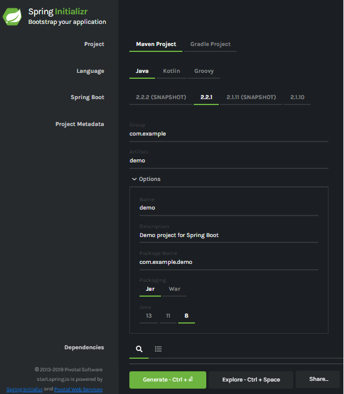
</details>
<details>
<summary>Tạo 1 dự án</summary>
Trước khi tạo 1 dự án, ta phải làm quen với giao diện, với các labels sau:

*   **Project:** Định nghĩa kiểu project. Có thẻ tạo Maven hoặc Gradle Project.
*   **Language:** Cung cấp lựa chọn giữa Java, Kotlin và Groovy.
*   **Spring Boot:** Lựa chọn phiên bản
*   **Project Metadata:** Bao gồm thông tin liên quan của dự án như Group, Artifact,vv.. **Group** biểu thị tên package, **Artifact** biểu thị tên ứng dụng
*   **Dependecies:** là các artifact mà ta có thể thêm vào dự án

> Có một phần tùy chọn khách nữa trong các trường sau:

-   Tên: Giống như Artifact
-   Miêu tả
-   ...
</details>
Nhất Generate Button để packing dự ấn và tải về jar hoặc war file.

### Spring boot example

Thực hiện các bước sau để tạo một Dự án SB đơn giản

**Step 1:** Mở Spring initializr https://start.spring.io
**Step 2:** Cung cấp **Group** và **Artifact**.
**Step 3:** Chọn nút **Generate**

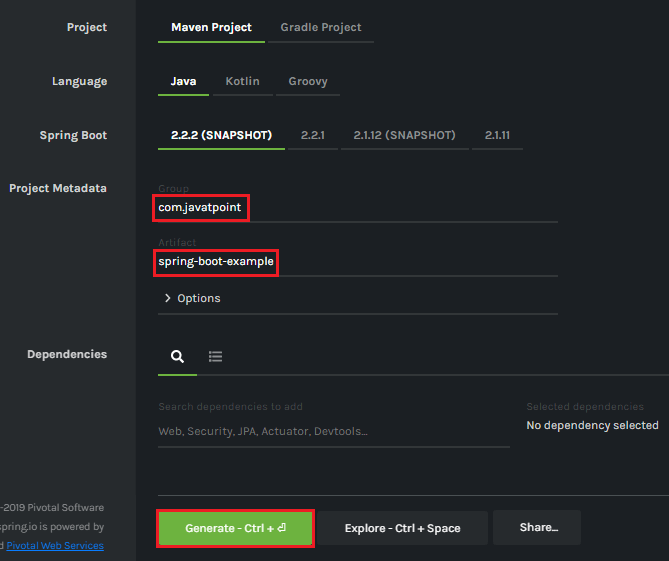

Sau đó ta chọn nút Generate, bắt đầu đóng gói dự án vào tệp .rar và tải xuống.

**Step 4:** Giải nén RAR file
**Step 5:** Import thư mục
File -> Import -> Existing Maven Project -> Next -> Browse -> Select the project -> Finish

Nó sẽ mất một thời gian để import project. Khi import xong, ta sẽ thấy được thư mục dự án ở **Package Explorer**.

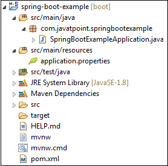

**SpringBootExampleApplication.java**

```{java} package com.javatpoint.springbootexample;
import org.springframework.boot.SpringApplication;
import org.springframework.boot.autoconfigure.SpringBootApplication;
@SpringBootApplication
public class SpringBootExampleApplication
{
public static void main(String[] args)
{
SpringApplication.run(SpringBootExampleApplication.class, args);
}
}
```

**pom.xml**

```{xml}
<?xml version="1.0" encoding="UTF-8"?>
<project xmlns="http://maven.apache.org/POM/4.0.0" xmlns:xsi=http://www.w3.org/2001/XMLSchema-instance xsi:schemaLocation="http://maven.apache.org/POM/4.0.0 https://maven.apache.org/xsd/maven-4.0.0.xsd">
<modelVersion>4.0.0</modelVersion>
<parent>
<groupId>org.springframework.boot</groupId>
<artifactId>spring-boot-starter-parent</artifactId>
<version>2.2.2.BUILD-SNAPSHOT</version>
<relativePath/> <!-- lookup parent from repository -->
</parent>
<groupId>com.javatpoint</groupId>
<artifactId>spring-boot-example</artifactId>
<version>0.0.1-SNAPSHOT</version>
<name>spring-boot-example</name>
<description>Demo project for Spring Boot</description>
<properties>
<java.version>1.8</java.version>
</properties>
<dependencies>
<dependency>
<groupId>org.springframework.boot</groupId>
<artifactId>spring-boot-starter</artifactId>
</dependency>
<dependency>
<groupId>org.springframework.boot</groupId>
<artifactId>spring-boot-starter-test</artifactId>
<scope>test</scope>
<exclusions>
<exclusion>
<groupId>org.junit.vintage</groupId>
<artifactId>junit-vintage-engine</artifactId>
</exclusion>
</exclusions>
</dependency>
</dependencies>
<build>
<plugins>
<plugin>
<groupId>org.springframework.boot</groupId>
<artifactId>spring-boot-maven-plugin</artifactId>
</plugin>
</plugins>
</build>
<repositories>
<repository>
<id>spring-milestones</id>
<name>Spring Milestones</name>
<url>https://repo.spring.io/milestone</url>
</repository>
<repository>
<id>spring-snapshots</id>
<name>Spring Snapshots</name>
<url>https://repo.spring.io/snapshot</url>
<snapshots>
<enabled>true</enabled>
</snapshots>
</repository>
</repositories>
<pluginRepositories>
<pluginRepository>
<id>spring-milestones</id>
<name>Spring Milestones</name>
<url>https://repo.spring.io/milestone</url>
</pluginRepository>
<pluginRepository>
<id>spring-snapshots</id>
<name>Spring Snapshots</name>
<url>https://repo.spring.io/snapshot</url>
<snapshots>
<enabled>true</enabled>
</snapshots>
</pluginRepository>
</pluginRepositories>
</project>
```

**Step 6:** Run the **SpringBootExampleApplication.java** file.
chuột phải vào file -> Run As -> Java Applications
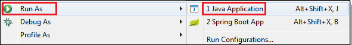
Khi chạy thành công ta sẽ được
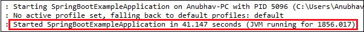

### Spring boot CLI

Đây là một công cụ mà bạn có thể tải về từ trang chính thức của Spring Framework. Đây là ví dụ cụ thể:

-   Tải CLI tool từ trang chính thức
    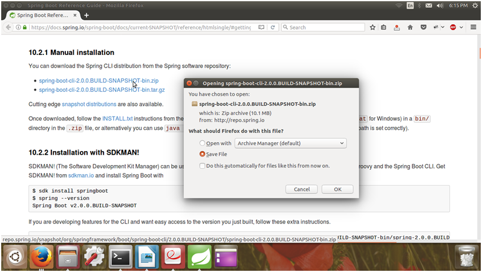
-   Giải nén file zip. Nó bao gồm thư mục bin, nơi mà các cài đặt của spring được lưu. Ta có thể dùng nó để thực thi ứng dụng SB
    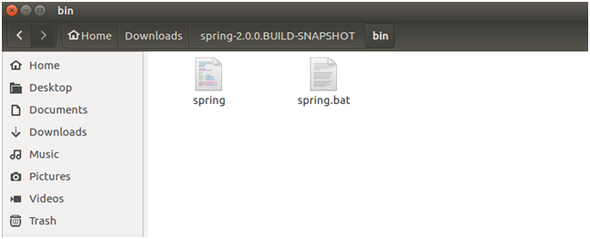
-   CLI có thể thực thi groovy. Đầu tiên ta cần tạo Groovy file cho ứng dụng SB
-   Mở terminal và cd đến vị trí thư mục bin của CLI folder
    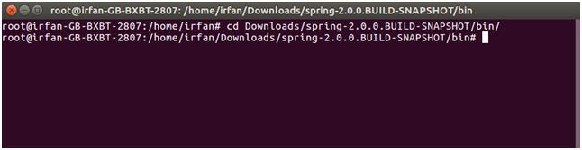

*   Tạo một groovy file:
    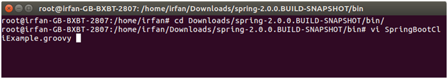

-   Tạo một controller trong groovy file:
    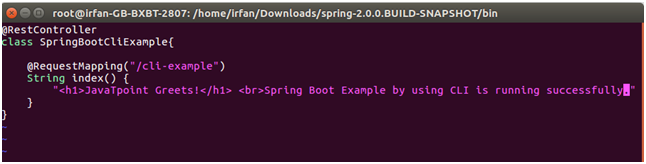

-   thực thi file này bằng:
    > /spring run SpringBootCliExample.groovy

*   Kết quả:
    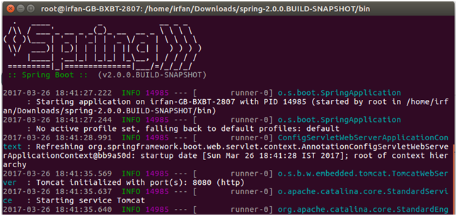
    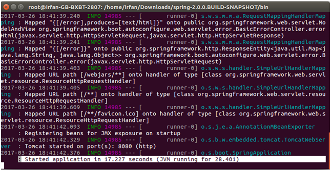

### SB Example-STS

## Project Components

### SB Annotations

### SB Dependency Management

### SB Application Properties

### SB Starter

### SB Starter Parent

### SB Starter Web

### SB Starter Data JPA

### SB Starter Actuator

### SB Starter Test

### SB Devtools

### Multi Module Projects

### SB Packaging

### SB Auto-configuration

## Tool Suite

### Hello World Example

### Project Deployment Using Tomcat

## Spring AOP

### Spring boot AOP

### AOP before Advice

### AOP After Advice

### AOP around advice

### After Returning Advice

### After Throwing Advice

## Spring boot Database

### Spring boot JPA

### SPring boot JDBC

### SB JDBC Example

### SB H2 Database

### SB CRUD Operations

## Spring Boot View

### SB Thymeleaf View

## SB Caching

### Spring Boot Caching

### SB Cache Provider

### Spring Boot EhCaching

## Spring Boot Misc

### Run SB Application

### SB Change Port

### SB REST Example

## Spring Boot RESTfull

### Introduction to RESTful Web Service with Spring Boot

### Initializing a RESTful Web Services

### Spring Boot Auto Configuration and Dispatcher Servlet

### Enhancing the Hello World Service with a Path Variable

### Implementing the POST Method to create User Resource

### Implementing Exception Handling- 404 Resource Not Found

### Implementing Generic Exception Handling for all Resources

### Implementing DELETE Method to Delete a User Resource

### Implementing Validations for RESTful Services

### Implementing HATEOAS for RESTful Services

### Internationalization of RESTful Services

### Content Negotiation Implementing Support for XML

### Configuring Auto Generation of Swagger Documentation

### Introduction to Swagger Documentation Format

### Enhancing Swagger Documentation with Custom Annotations

### Monitoring APIs with Spring Boot Actuator

### Implementing Static Filtering for RESTful Services

### Implementing Dynamic Filtering for RESTful Services

### Versioning RESTful Web Services-Basic Approach With URIs

### Implementing Basic Authentication with Spring Security

### Connecting RESTful Services to JPA

### Updating GET Methods on User Resource to Use JPA

### Updating POST and DELETE methods on User

### Resource to use JPA

### Creating Post Entity and Many to One Relationship with User Entity

### Implementing a GET service to retrieve all Posts of a User

### Implementing POST Service to Create a Post for a User

### Richardson Maturity ModelRESTful Web Services Best Practice

## Spring tutorial

### Spring tutorial

## Spring Cloud

### Spring Cloud tutorial

## Spring Microsevices

### Spring Microsevices Tutorial

## Chú thích
