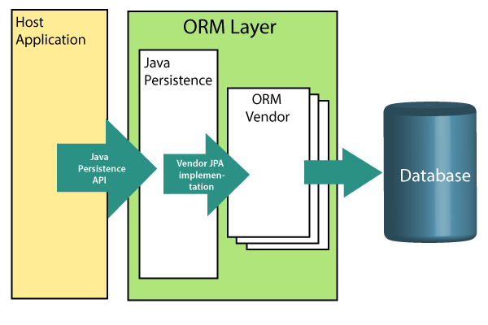

# Spring boot tutorial

Đây là kho lưu trữ quá trình học **Spring boot** của tôi, dựa trên [tutorial](https://www.javatpoint.com/spring-boot-tutorial) của Javapoint. Repository này sẽ được chỉnh sửa trong quá trình tôi tìm hiểu thêm

## Spring boot tutorial {spring-boot-tutorial}

### Spring boot tutorial

Hướng dẫn Spring Boot cung cấp các khái niệm cơ bản của Spring Framework. Hướng dẫn này được cung cấp cho cả người mới và chuyên nghiệp

Spring Boot là một mô đun của Spring, cung cấp đặc tính RAD (Rapid Application Development) cho Framework Spring

Hướng dẫn này sẽ cung cấp các chủ đề như tính năng, dự án, dự án maven, starter project wizard, Spring Initializr, CLI (giao diện dòng lệnh), applications, chú thích, quản lí phụ thuộc, đặc tính, starters, Actuator,JPA,JDBC, vv...

<details>
    <summary><strong>Spring boot là gì</strong></summary>
    <p>Spring boot là một dự án dựa trên phần trên của Spring. Nó cung cấp một cách dễ dàng và nhanh chóng để thiết lập, cấu hình và chạy cả các ứng dụng đơn giản và web-based </p>
    Đây là một mô hình cung cấp tính năng phát triển ứng dụng nhanh để tạo một ứng dụng Spring độc lập với cấu hình tối thiểu <br>
    
    Nói tóm lại, SB là sự kết hợp của Spring Framework và Embedded Servers. <br>
    SB không cần thiết việc cấu hình XML. Nó sử dụng các quy ước về mô hình thế kế phần mềm để giúp nhà phát triển dễ dàng hơn
    <strong>Tại sao nên sử dụng SB</strong>
    <ul>
    <li>Sử dụng dependency injection </li>
    <li>Khả năng quản lý cơ sở dũ liệu mạnh mẽ</li>
    <li>Đơn giản hóa các Framework khác như JPA/Hibernate ORM, Struts, etc..</li>
    <li>Giảm chi phí và thời gian phát triển</li>
    </ul>
    Ngoài ra Spring cũng cung cấp nhiều các dự án Spring con giúp xây dựng các ứng dụng đáp ứng nhu cầu kinh doanh hiện nay.
    <ul>
    <li><Strong>Spring Data:</strong> Nó đơn giản hóa việc truy cập cơ sở dữ liệu quan hệ hoặc NoSQL</li>
    <li><Strong>Spring Batch:</strong>Khả năng xử lý hàng loạt(batch) mạnh mẽ</li>
    <li><Strong>Spring Security:</strong> cung cấp sự an toàn cho ứng dụng</li>
    <li><Strong>Spring Social:</strong>Hỗ trợ tích hợp mạng xã hội như LinkedIn</li>
    <li><Strong>Spring Integration:</strong>Hỗ trợ tích hợp với các ứng dụng doanh nghiệp khác sử dụng tin nhắn nhẹ (lightweight message) và khai báo adapters</li>
    </ul>
    <h4>Lợi ích của SB</h4>
    <ul>
    <li>Tạo các ứng dụng độc lập có thể chạy sử dụng Java -jar</li>
    <li>Kiểm thử ứng dụng web dễ dàng với các máy chủ HTTP nhúng khác nhau như Tomcat, Jetty,... Không cần triển khai WAR files</li>
    <li>Cung cấp các "starters" POMs giúp cấu hình Maven dễ dàng  </li>
    <li>Cung cấp các tính năng của sản phẩm sẵn sàng như metrics(số liệu), health checks(kiểm tra tình trạng) và externalized configuration(cấu hình bên ngoài)</li>
    <li>Không cần các cấu hình XML</li>
    <li>Cung cấp CLI cho phát triển và kiểm thử</li>
    <li>Cung cấp nhiều plug-ín</li>
    <li>Giảm thiểu viết  nhiều boilerPlate codes (code được viết nhiều nơi mà không thay đổi), cấu hình XML và chú thích (annotations)</li>
    <li>Tăng hiệu quả và giảm thời gian phát triển</li>
    </ul>
    <h4>Hạn chế của SB</h4>
    SB có thể sử dụng các phụ thuộc không được sử dụng trong ứng dụng. Các phụ thuộc này làm tăng kích thước ứng dụng
    <h4>Mục tiêu của SB</h4>
    Mục tiêu chính của SB là giảm thời gian phát triển, unit test và integration test,
    <ul>
    <li>Provides Opinionated Development approach</li>
    <li>Tránh định nghĩa nhiều cấu hình Annotation</li>
    <li>Tránh viết nhiều mệnh đề import</li>
    <li>Tránh cấu hình XML</li>
</ul>
<h4>Các tính năng của SB</h4>
<ul>
..
</ul>
</details>

### Spring boot version

Phiên bản SB mới nhất là SB 3, yêu cầu phiên bản tối thiểu Java 17, Graal 22.3 or later và Native Build Tools Plugin 0.9.17 hoặc hơn
**Các thay đổi chính**

-   Hỗ trợ GraalVM Native Image
-   Cải tiến Log4j2
-   Cải thiện nhận biết **@ConstructorBinding**
-   Nâng cấp Micrometer (chưa biết)
-   Cấu hình linh hoạt hơn cho Spring Data JDBC
-   ...

### Spring vs Spring Boot vs Spring MVC

<details>
<summary>Spring vs. Spring Boot</summary>

**Spring:** là một framework phát triển ứng dụng phổ biến của Java. Tính năng chính của Spring FrameWork là DI và IoC. Với sự hỗ trợ của Spring, ta có thể phát triển một ứng dụng với kết nối lỏng lẻo (?)
**Spring Boot:** là một module của Spring. Nó cho phép ta build một ứng dụng độc lập với mức tối thiểu hoặc không cấu hình. Nó được ưu tiên sử dụng nếu muốn xấy dựng một ứng dụng Spring-base đơn giản hoặc các dịch vụ RESTfull
| Spring | Spring Boot |
| :---------------- | :------ |
| Spring là một framework EE được sử dụng rộng rãi | Spring Boot được sử dụng để phát triển REST APIs |
| Nó nhằm đơn giản hóa việc phát triển Java EE| Nhằm viết code ngắn và cung cấp cách đơn giải để phát triển ứng dụng web |
| Tính năng chính của Spring là DI | Tính năng chính của Spring là **AutoConfiguration** |
| Giúp mọi thứ đơn giản hơn với việc phát triển các ứng dụng liên kết lỏng lẻo | Giúp tạo các ứng dụng độc lập với ít cấu hình |
| LTV cần viết nhiều boilerplate code để làm tác vụ đơn giản nhất | giảm thiểu boilerplate code |
| Để kiểm thử dự án, cần thiết lập server rõ ràng | Cung cấp server nhúng như Jetty hay Tomcat |
| Không cung cấp CSDL in-memory | cung cấp plugin để làm việc với CSDL in-memory như H2 |
| Cần khai báo thủ công các phụ thuộc trong pom.xml | Có khái niệm "starter" tự động tải các phụ thuộc JARs

</details>

<details>
<summary>Spring Boot vs. Spring MVC</summary>

**Spring Boot:** giúp phát triển nhanh chóng ứng dụng Spring, tránh sử dụng nhiều boilerplate code. Giấu sự phức tạp để nhà phát triển phát triển ứng dụng dễ dàng

**Spring MVC:** là một Web MVC Framework để xây dựng ứng dụng web. Nó bao gồm nhiều khả năng. Là một framework phát triển ứng dụng hướng HTTP

> Spring Boot và Spring MVC tồn tại cho các mục đích khác nhau. Sự so sánh chính sẽ được chỉ ra bên dưới:

| Spring boot                                                                               | Spring MVC                                                             |
| :---------------------------------------------------------------------------------------- | :--------------------------------------------------------------------- |
| Một modun dựa trên Spring để đóng gói các ứng dụng Spring với các giá trị mặc định hợp lý | Một Web Framework dựa trên model view controller dưới Spring FrameWork |
| Cung cấp các cấu hình mặc định                                                            | Cung cấp các tính năng sẵn sàng để tạo web app                         |
| Không cần cấu hình tay                                                                    | Cần cấu hình tay                                                       |
| Không cần deployment descriptor                                                           | cần 1 Deployment descriptor                                            |
| Tránh boilerplate code và gói các phụ thuộc trong 1 unit                                  | Chỉ định từng dependency riêng biệt                                    |
| Giảm thời gian phát triển                                                                 | Cần nhiều thời gian để đạt được tương tự                               |

</details>

### SB architecture

Spring Boot tuân theo kiến trúc phân tầng trong đó mỗi lớp giao tiếp với mỗi lớp bên dưới hoặc lớp bên trên của nói.
Có **4** lớp trong SB:

1. **Presentation Layer**
1. **Business Layer**
1. **Persistency Layer**
1. **Database Layer**


**Presentation Layer:** Xử lý các HTTP requests, translate các tham số JSON sang object, xác thực các chuyển nó sang Business Layer. Nói ngắn gọn là phần giao diện.

**Bussiness Layer:** Xử lý các **business logic**. Nó bao gồm các lớp dịch vụ (service class) và sử dụng các dịch vụ được cung cấp bởi lớp truy cập data. Nó cũng thực hiện **authorization** và **validation**

**Persistence Layer:** Bao gồm các logic lưu trữ và translate các business object sang các hàng trong CSDL

**Database Layer:** Các thao tác **CRUD** (Create, Retrieve, Update, Delete) được thực hiện

#### Kiến trúc luồng SB (SB Flow architecture)


-   Bây giờ ta có các lớp validator, view, và tiện ích (utility)
-   SB sử dụng tất cả các modun như Spring MVC, Spring Data, etc. Kiến trúc SB giống với của Spring MVC, ngoại trừ: Không cần lớp DAO và DAOImpl trong Spring Boot
-   Tạo một lớp data access và thực hiện thao tác CRUD
-   Máy khách tạo HTTP requests (PUT or GET)
-   Yêu cầu đi đến controller và controller sẽ map các yêu cầu và xử lý nó. Sau đó nó sẽ gọi các service logic nếu cần thiết.
-   Trong tầng service, tất cả các bussiness logic được thực hiện. Nó thực hiện logic ở dữ liệu được ánh xạ tới JPA với các lớp Model
-   Một trang JSP được trả về nếu không có lỗi được xảy ra

## Creating Project {#creating-project}

### Spring Initialzr

**Spring Initializr** là một công cụ **web-based** cung cấp bới Pivotal Web Serivce. Với sự giúp đỡ của nó. Ta có thể dễ dàng tạo cấu trúc của dự án Spring Boot. Nó cung cấp các API có thể mở rộng để tạo các dự án JVM-based.

Nó cũng cung cấp nhiều lựa chọn khác nahu cho dự án dưới dạng một mô hình siêu dữ liệu (metadata model). Mô hình siêu dữ liệu này cho phép ta cấu hình danh sách các phụ thuộc được hỗ trợ bởi JVM và các phiên bản nền tảng,... Nó phục vụ siêu dữ liệu dưới dạng nổi tiếng cung cấp hỗ trợ cần thiết cho bên thứ ba

<details>
<summary>Spring Initialzr Modules</summary>
Có các module:

-   **initializr-actuator:** cung cấp các thông tin và thống kê bổ sung cho việc tạo dự án. Nó là 1 optional module.
-   **initialzr-bom:** BOM viết tắt của **Bill of Materials**. Trong SB, BOM là 1 loại đặc biệt của **POM**, cái sử dụng để quản lý các version của phụ thuộc. Nó cung cấp 1 nơi tập trung các định nghĩa và nâng cấp các version của nó. Nó cung cấp sự linh hoạt trong thêm các phụ thuộc mà ko cần lo về version. Ngoài thế giới phần mềm, nó là danh sách các phần, item, .... để tạo sản phẩm. Nó giải thích _what_, _how_ và _where_ để tìm kiếm tài nguyên cần thiết

-   **initializr-docs:** Cung cấp tài liệu
-   **initializr-generator:** Nó là thư viện tạo dự án cốt lõi
-   **initializr-generator-test:** Cung cấp cơ sở hạ tầng kiểm thử cho việc tạo dự án
-   **initializr-metadata:** Cung cấp cơ sở hạ tầng metadata cho các aspect khác nhau của dự án.
-   **initializr-service-example:** Cung cấp các instance tùy chỉnh.
-   **initializr-version-resolver:** Là một module tùy chọn để trích xuất số phiên bản từ POM.
-   **initializr-web:** Nó cung cấp web enpoints cho clients bên thứ 3.
</details>
<details>
<summary>Các giao diện hỗ trợ</summary>

-   IDE STS, IntelliJ IDEA Ultimate, NetBeans, Eclipse
-   Custom Web UI http://start.spring.io or https://start-scs.cfapps.io.
-   Custom Web UI http://start.spring.io or https://start-scs.cfapps.io.

</details>
<details>
<summary>Tạo 1 dự án</summary>
Trước khi tạo 1 dự án, ta phải làm quen với giao diện, với các labels sau:

*   **Project:** Định nghĩa kiểu project. Có thẻ tạo Maven hoặc Gradle Project.
*   **Language:** Cung cấp lựa chọn giữa Java, Kotlin và Groovy.
*   **Spring Boot:** Lựa chọn phiên bản
*   **Project Metadata:** Bao gồm thông tin liên quan của dự án như Group, Artifact,vv.. **Group** biểu thị tên package, **Artifact** biểu thị tên ứng dụng
*   **Dependecies:** là các artifact mà ta có thể thêm vào dự án

> Có một phần tùy chọn khách nữa trong các trường sau:

-   Tên: Giống như Artifact
-   Miêu tả
-   ...
</details>
Nhất Generate Button để packing dự ấn và tải về jar hoặc war file.

### Spring boot example

Thực hiện các bước sau để tạo một Dự án SB đơn giản

**Step 1:** Mở Spring initializr https://start.spring.io
**Step 2:** Cung cấp **Group** và **Artifact**.
**Step 3:** Chọn nút **Generate**


Sau đó ta chọn nút Generate, bắt đầu đóng gói dự án vào tệp .rar và tải xuống.

**Step 4:** Giải nén RAR file
**Step 5:** Import thư mục
File -> Import -> Existing Maven Project -> Next -> Browse -> Select the project -> Finish

Nó sẽ mất một thời gian để import project. Khi import xong, ta sẽ thấy được thư mục dự án ở **Package Explorer**.


**SpringBootExampleApplication.java**

```{java} package com.javatpoint.springbootexample;
import org.springframework.boot.SpringApplication;
import org.springframework.boot.autoconfigure.SpringBootApplication;
@SpringBootApplication
public class SpringBootExampleApplication
{
public static void main(String[] args)
{
SpringApplication.run(SpringBootExampleApplication.class, args);
}
}
```

**pom.xml**

```{xml}
<?xml version="1.0" encoding="UTF-8"?>
<project xmlns="http://maven.apache.org/POM/4.0.0" xmlns:xsi=http://www.w3.org/2001/XMLSchema-instance xsi:schemaLocation="http://maven.apache.org/POM/4.0.0 https://maven.apache.org/xsd/maven-4.0.0.xsd">
<modelVersion>4.0.0</modelVersion>
<parent>
<groupId>org.springframework.boot</groupId>
<artifactId>spring-boot-starter-parent</artifactId>
<version>2.2.2.BUILD-SNAPSHOT</version>
<relativePath/> <!-- lookup parent from repository -->
</parent>
<groupId>com.javatpoint</groupId>
<artifactId>spring-boot-example</artifactId>
<version>0.0.1-SNAPSHOT</version>
<name>spring-boot-example</name>
<description>Demo project for Spring Boot</description>
<properties>
<java.version>1.8</java.version>
</properties>
<dependencies>
<dependency>
<groupId>org.springframework.boot</groupId>
<artifactId>spring-boot-starter</artifactId>
</dependency>
<dependency>
<groupId>org.springframework.boot</groupId>
<artifactId>spring-boot-starter-test</artifactId>
<scope>test</scope>
<exclusions>
<exclusion>
<groupId>org.junit.vintage</groupId>
<artifactId>junit-vintage-engine</artifactId>
</exclusion>
</exclusions>
</dependency>
</dependencies>
<build>
<plugins>
<plugin>
<groupId>org.springframework.boot</groupId>
<artifactId>spring-boot-maven-plugin</artifactId>
</plugin>
</plugins>
</build>
<repositories>
<repository>
<id>spring-milestones</id>
<name>Spring Milestones</name>
<url>https://repo.spring.io/milestone</url>
</repository>
<repository>
<id>spring-snapshots</id>
<name>Spring Snapshots</name>
<url>https://repo.spring.io/snapshot</url>
<snapshots>
<enabled>true</enabled>
</snapshots>
</repository>
</repositories>
<pluginRepositories>
<pluginRepository>
<id>spring-milestones</id>
<name>Spring Milestones</name>
<url>https://repo.spring.io/milestone</url>
</pluginRepository>
<pluginRepository>
<id>spring-snapshots</id>
<name>Spring Snapshots</name>
<url>https://repo.spring.io/snapshot</url>
<snapshots>
<enabled>true</enabled>
</snapshots>
</pluginRepository>
</pluginRepositories>
</project>
```

**Step 6:** Run the **SpringBootExampleApplication.java** file.
chuột phải vào file -> Run As -> Java Applications

Khi chạy thành công ta sẽ được


### Spring boot CLI

Đây là một công cụ mà bạn có thể tải về từ trang chính thức của Spring Framework. Đây là ví dụ cụ thể:

-   Tải CLI tool từ trang chính thức
    
-   Giải nén file zip. Nó bao gồm thư mục bin, nơi mà các cài đặt của spring được lưu. Ta có thể dùng nó để thực thi ứng dụng SB
    
-   CLI có thể thực thi groovy. Đầu tiên ta cần tạo Groovy file cho ứng dụng SB
-   Mở terminal và cd đến vị trí thư mục bin của CLI folder
    

*   Tạo một groovy file:
    

-   Tạo một controller trong groovy file:
    

-   thực thi file này bằng:
    > /spring run SpringBootCliExample.groovy

*   Kết quả:
    
    

## Project Components

### SB Annotations

Spring Boot Annotation là một kiểu siêu dữ liệu cung cấp dữ liệu cho chương trình. Nói cách khác, nó cung cấp thông tin **bổ sung** cho chương trình. Nó không phải là một phần của ứng dụng mà chúng ta phát triển. Nó không có ảnh hưởng trực tiếp đến sự vận hành của đoạn code ta chú thích. Nó cũng không thay đổi việc biên dịch chương trình.

<details>
<summary><b>Các annotation chính của Spring</b> </summary>

**@Require:** được dùng cho phương thức Setter của Bean. Nó chỉ ra các Bean được đánh dấu phải được điền vào lúc cấu hình với thuộc tính bắt buộc nếu không sẽ ném ra ngoại lệ **BeanInitializationExcetption**.
**Ví dụ:**

```java
@Component
public class Customer
{
private Person person;
@Autowired
public Customer(Person person)
{
this.person=person;
}
}
```

**@Autowired:** Nó dùng để tự động kết nối Spring Bean ở phương thức Setter, biến đối tượng và constructor. Khi dùng @Autowire, Spring container sẽ tự động nối Bean theo kiểu dữ liệu
**Ví dụ:**

```java
@Component
public class Customer
{
private Person person;
@Autowired
public Customer(Person person)
{
this.person=person;
}
}
```

**Configuration:**: Là một chú thích cấp lớp.Các lớp chú thích bằng @Configuration sẽ được Spring Container sử dụng làm nguồn định nghĩa Bean

**Ví dụ**

```java
@Configuration
public class Vehicle
{
@BeanVehicle engine()
{
return new Vehicle();
}
}
```

**@Component:** sử dụng khi cần quét 1 packages tìm Bean. Nó sử dụng với @Configuration. Ta có thể chỉ định các gói cơ sở để quét các Spring Component.
**Ví dụ**

```java
@ComponentScan(basePackages = "com.javatpoint")
@Configuration
public class ScanComponent
{
// ...
}
```

**@Bean:** Là một chú thích mức phương thức. Nó thay thế cho Bean tag trong XML. Nó bảo phương thức sản xuất ra 1 bean được quản lý bởi Spring Container

**Example**

```java
@Bean
public BeanExample beanExample()
{
return new BeanExample ();
}
```

</details>

<details>
<summary><b>Chú thích Stereotype (khuôn mẫu) Spring Framework</b></summary>

**Component:** là chú thích cấp class. Nó dùng để đánh dấu 1 class như 1 bean. Class bị đánh dấu sẽ được tìm thấy trong đương dẫn lớp (classpath). Spring container sẽ chọn và cấu hình nó trong application context như 1 Spring Bean
**Controller:** Là chú thích cấp class. Là trường hợp đặc biệt của **@Compoent**. Nó đánh dấu một lớp là trình xử lý yêu cầu web. Nó thường dùng để phục vụ các trang web. Mặc định , nó trả về chuỗi cho biết route sẽ chuyển hướng. Thường được dùng với @RequestMapping

```java
@Controller
@RequestMapping("books")
public class BooksController
{
@RequestMapping(value = "/{name}", method = RequestMethod.GET)
public Employee getBooksByName()
{
return booksTemplate;
}
}
```

**Service:** được dùng ở cấp class. Nó nói rănfg lớp này chứa các bussiness logic
**Repository:** Nó là một chú thích cấp class. Repository là một DAOs (Data Access Object) mà có thể truy cập trực tiếp . Nó thực hiện tất cả hoạt động liên quan đến DB.

</details>

<details>
<summary><b>Chú thích Spring Boot</b></summary>

-   **@EnableAutoConfiguration:** Nó tự động cấu hình Bean đang có trong classpath và cấu hình nó để chạy các phương thức. Việc sử dụng chú thích này bị giảm sau Spring Boot 1.2.0 vì nhà phát triển đã cung cấp giải pháp thay thế **SpringBootApplication**
-   **@SpringBootApplication:** sự kết hợp của **@EnableAutoConfiguration**, **@ComponentScan**, và **@Configuration**
</details>
<details>
<summary><b>Spring MVC and REST Annotations</b></summary>

**RequestMapping:** Sử dụng để ánh xạ các yêu cầu của trang web. Nó có nhiều phần tử lựa chọn như **onsumes, header, method, name, params, path, produces**, và **value**. Ta có thể dùng với class cũng như method
**Ví dụ:**

```java
    @Controller
public class BooksController
{
@RequestMapping("/computer-science/books")
public String getAllBooks(Model model)
{
//application code
return "bookList";
}
}
```

-   **@GetMapping:** Ánh xạ yêu cầu HTTP GET ở một phương thức xử lý xác định. Nó được sử dụng để tạo một điểm cuối (endpoint) để **fetches**(tìm nạp). Được sử dụng thay **@RequestMapping(method = RequestMethod.GET)**
-   **@PostMapping:** Ánh xạ yêu cầu HTTP Post ở một phương thức xử lý xác định. Nó được sử dụng để tạo một điểm cuối (endpoint) để **create**(tạo). Được sử dụng thay **@RequestMapping(method = RequestMethod.POST)**
-   **@PutMapping:** Ánh xạ yêu cầu HTTP PUT ở một phương thức xử lý xác định. Nó được sử dụng để tạo một điểm cuối (endpoint) để **create hoặc update**(tạo hoặc thêm). Được sử dụng thay **@RequestMapping(method = RequestMethod.GET)**
-   **@DeleteMapping:** Ánh xạ yêu cầu HTTP Delete ở một phương thức xử lý xác định. Nó được sử dụng để tạo một điểm cuối (endpoint) để **delete a resource**(xóa một tài nguyên). Được sử dụng thay **@RequestMapping(method = RequestMethod.GET)**
-   **@PatchMapping:** Ánh xạ yêu cầu HTTP Ơatch ở một phương thức xử lý xác định. Được sử dụng thay **@RequestMapping(method = RequestMethod.PATCH)**
-   **@RequestBody:** sử dụng để **liên kết (bind)** các yêu cầu HTTP với 1 object như 1 tham số phương thức. Bên trong nó sử dụng HTTP MessageConverters để convert phần thân của request. Khi chúng ta đánh dấu một tham số với @RequestBody, Spring sẽ liên kết nội dung đến của HTTP request với tham số đó
-   **@ResponseBody:** Sử dụng để liên kết các giá trị trả về. Nó yêu cầu Spring Boot serialize kết quả trả về sang dạng JSON và XML
-   **@PathVariable:** Nó dùng để lấy giá trị từ ỦI.Nó phù hợp với đat số RESTfull web service, nơi mà URL bao gồm cả biến đường dẫn.
-   **@RequestParam:** Sử dụng để truy vấn các tham số từ URL, còn được gọi là **query parameter**. Nó phù hợp nhất với các ứng dụng web. Nó có thể chỉ định giá trị mặc định nếu tham số không tồn tại trong URL.

-   **@RequestHeader:** Sử dụng để lấy thông tin chi tiết từ yêu cầu HTTP request. Chúng ta sử dụng chú thích này như một tham số trong phương thức. Các giá trị tùy chọn của tham số này là **name, required, value, defaultValue.** Với mỗi chi tiết trên header, ta nên chỉ định chú thích riêng. Ta cũng có thể dùng nhiều lần trong 1 method
-   **@RestController:** Nó có thể coi là sự kết hợp giữa **@Controller và @ResponseBody**. Tự nó đánh dấu với @ResponseBody, loại bỏ nhu cầu đánh dấu từng dnonfg
-   **@RequestAttribute:** Nó liên kết tham số phương thức với thuộc tính yêu cầu. Nó cung cấp cách truy cập thuận tiện tới các thuộc tính yêu cầu từ phương thức controller. Vowis @RequestAttribute, ta có thể truy cập vào objects nếu nó được điền trong serversize.
</details>

### SB Dependency Management

SB quản lý các phụ thuộc và cấu hình một cách tự động. Mỗi bản phát hành cung cấp một danh sách các phụ thuộc mà nó hỗ trợ. Danh sách phụ thuộc khả dụng là một phần của BOM (Bills of Materials) có thể sử dụng với **Maven**.

#### Lợi ích của quản lý phụ thuộc

-   Cung cấp sự tập trung thông tin của phụ thuộc bằng việc chỉ định phiên bản SB tại 1 nơi. Nó giúp chuyển đổi phiên bản dễ dàng hơn.
-   Tránh sự không khớp giữa các phiên bản khác nhau của các thư viện SB
-   Chỉ cần sửa thư viện với version chỉ định. Hữu ích trong dự án multi-module
    > **NOTE:** SB có thể ghi đè các phiên bản phụ thuộc nêu cần thiết

#### Hệ thống quản lý phụ thuộc Maven

Dự án Maven kế thừa các đặc tính của **spring-boot-starter-parent**:

-   Mặc định phiên bản Java Compiler
-   Mã hóa mã nguồn bằng **UTF-8**
-   Kế thừa một **phần phục thuộc (Dependency Section)** từ spring-boot-dependency-pom. Nó quản lý version của các phụ thuộc chung. Nó sẽ bỏ qua thẻ version ở các phụ thuộc này
-   Sensible **resource filtering** (lọc tài nguyên hợp lý)
-   Sensible **plugin configuration** (cấu hình plugin hợp lý)

### SB Application Properties

SB đi kèm với cơ chế cấu hình application sử dụng một file tên **application.properties**. Nó nằm trong thư mục **src/main/resources**


Spring Boot cung cấp nhiều thuộc tính khác nhau có thể cấu hình trong file **application.properties**. Các thuộc tính này có giá trị mặc định, ta có thể thay đổi nó hoặc tự định nghĩa thuộc tính nếu cần thiết
Nó cũng giúp ta có thể chạy ứng dụng trên các môi trường khác nhau. Tóm lại nó là để

-   Cấu hình SB
-   định nghĩa các thuộc tính tùy chỉnh của ứng dụng
    Ví dụ

```
#configuring application name
spring.application.name = demoApplication
#configuring port
server.port = 8081
```

#### YAML Properties File

SB cung cấp một file khác để cấu hình được gọi là **yml**. File Yaml hoạt động bởi vì có **Snake YAML** jar nằm trong classpath. Thay vì sử dụng **application.properties**, ta có thể dùng application.yml, nhưng YML file cần nằm trong class path

**Ví dụ**

```
spring:
    application:
        name: demoApplication
server:
    port: 8081
```

#### Các loại thuộc tính SB

Có 16 loại là :

1. Core Properties
1. Cache Properties
1. Mail Properties
1. JSON Properties
1. Data Properties
1. Transaction Properties
1. Data Migration Properties
1. Integration Properties
1. Web Properties
1. Templating Properties
1. Server Properties
1. Security Properties
1. RSocket Properties
1. Actuator Properties
1. DevTools Properties
1. Testing Properties
 <details>
 <summary><b>Bảng thuộc tính phổ biến</b></summary>

| Property                                              |    Default Values     | Description                                                                                                             |
| :---------------------------------------------------- | :-------------------: | ----------------------------------------------------------------------------------------------------------------------- | 
| Debug                                                 |         False         | Bật log debug                                                                                                           |
| spring.application.name                               |                       | Đặt tên ứng dụng                                                                                                        |
| spring.applicatoin.admin.enable                       |         false         | Bật tính năng admin của ứng dụng                                                                                        |
| spring.config.name                                    |      application      | đặt tên cho file config                                                                                                 |
| spring.config.location                                |                       | Sử dụng để chỉ định vị trí file config                                                                                  |
| server.port                                           |         8080          | cấu hình cổng HTTP server                                                                                               |
| server.servlet.context-path                           |                       | Nó cấu hình context path của ứng dụng                                                                                   |
| logging.file.path                                     |                       | Dùng để cấu hình vị trí của file log                                                                                    |
| spring.banner.charset                                 |         UTF-8         | Mã hóa tập tin biểu ngữ (banner file)                                                                                   |
| spring.banner.location                                | classpath:banner.txt  | sử dụng để cài đặt vị trí file banner                                                                                   |
| logging.file                                          |                       | Cài đặt tên cho file log                                                                                                |
| spring.application.index (đã ngừng dùng sau spring 3) |                       | cài đặt chỉ mục ứng dụng                                                                                                |
| spring.mail.host                                      |                       | dùng dể thiết lập máy chủ SMTP (Simple mail transfer protocol)                                                          |
| spring mail.password                                  |                       | sử dụng để thiết lập mật khẩu của SMTP server                                                                           |
| spring.mail.port                                      |                       | thiết lập cổng SMTP server                                                                                              |
| spring.mail.sources                                   |                       | sử dụng để thiết lập nguồn (sources) cho chương trình                                                                   |
| server.address                                        |                       | thiết lập địa chỉ mạng mà máy chủ sẽ liên kết                                                                           |
| server.connection-timeout                             |                       | sử dụng để cài thời gian ở tính bằng milliseconds mà trình kết nối sẽ đợi một yêu cầu HTTP khách trước khi đóng kết nối |
| server.context-path                                   |                       | thiết lập context path của ứng dụng                                                                                     |
| server.server-header                                  |                       | dùng cho Server reponse header ( header không gửi đi nếu rỗng trường này rỗng)                                          |
| server.servlet-path                                   |           /           | thiết lập đường dẫn cho dispatcher servlet chính                                                                        |
| server.ssl.enable                                     |                       | sử dụng để bật hỗ trợ SSL                                                                                               |
| spring.http.multipart.enable                          |         True          | bật hỗ trợ uploads multi-part                                                                                           |
| spring.servlet.multipart.max-file-size                |          1MB          | sử dụng để cấu hình kích cỡ file lớn nhất                                                                               |
| spring.mvc.async.request-timeout                      |                       | thiết lập thời gian theo milliseconds                                                                                   |
| spring.mvc.date-format                                |                       | thiết lập format thời gian dd/MM/yyyy                                                                                   |
| spring.mvc.locale                                     |                       | Sử dụng để thiết lập locale cho ứng dụng                                                                                |
| spring.social.facebook.app-id                         |                       | thiết lập FB App ID của ứng dụng                                                                                        |
| spring.social.linkedin.app-id                         |                       | thiết lập linkedin App ID của ứng dụng                                                                                  |
| spring.social.twitter.app-id                          |                       | thiết lập twitter App ID của ứng dụng                                                                                   |
| security.basic.authorize-mode                         |         role          | thiết lập chế độ ủy quyền để ứng dụng                                                                                   |
| security.basic.enabled                                |         True          |                                                                                                                         | bật xác thực basic |
| spring.test.database.replace                          |          any          | loại DataSource hiện có để thay thế                                                                                     |
| spring.test.mockmvc.print                             |       mặc định        | Tùy chọn MVC Print                                                                                                      |
| spring.freemaker.content-type                         |       text/html       | Giá trị Content Type                                                                                                    |
| spring.security.filter.dispatcher-type                | async, error, request | loại Security filter chain dispatcher                                                                                   |
| spring.security.filter.order                          |         -100          | Security filter chain order                                                                                             |
| spring.security.oauth2.client.registration.\*         |                       | OAuth client registrations                                                                                              |
| spring.security.oauth2.client.provider.\*             |                       | OAuth provider details                                                                                                  |

 </details>

### SB Starter

### SB Starter Parent

### SB Starter Web

### SB Starter Data JPA

### SB Starter Actuator

### SB Starter Test

### SB Devtools

### Multi Module Projects

### SB Packaging

### SB Auto-configuration

## Tool Suite

### Hello World Example

### Project Deployment Using Tomcat

## Spring AOP

### Spring boot AOP

### AOP before Advice

### AOP After Advice

### AOP around advice

### After Returning Advice

### After Throwing Advice

## Spring boot Database

### Spring boot JPA

#### JPA là gì
**Spring Boot JPA** là một đặc tả (specification) for managing các dữ liệu **quan hệ** (**relational** data) trong ứng dụng Java. Nó cho phép ta truy cập và lưu trữ (persist) dữ liệu giữa các đối tượng/lớp và các CSDL quan hệ. JPA tuân theo **Object-Relation Mapping**  (ORM). Nó sự dụng một tập hợp các giao diện. Nó cung cấp một runtime **Entity Manager** API cho xử lý truy vấn và giao dịch trên các đối tượng đối với CSDL. Nó sử dụng ngôn ngữ truy vấn hướng đối tượng độc lập nền tảng JPQL (Java Persistent Query Language)

trong bối cảnh lưu trữ (context of persistence), nó bao gồm 3 lĩnh vực.
* Java Persistence API
* **Object-Relational** metadata
* Chính API, định nghĩa trong package **persistence**

> **NOTE:** JPA không phải 1 framework. Nó định nghĩa các khái niệm có thể triển khai bởi mọi framework

#### Tại sao ta nên sử dụng JPA

JPA dễ dàng, gọn gàng, ít tốn công sức hơn JDBC,SQL và ánh xạ thủ công. JPA phù hợp cho các ứng dụng phức tạp **không hướng hiệu suất** . Lợi ích chính của JPA hơn JDBC là ở JPA, dữ liệu được biểu diện đướ dạng đối tượng và lớp trong khi dữ liệu JDBC biểu diễn dưới dạng bảng và bản ghi. Nó sử dụng POJO để biểu diễn dữ liệu lưu trữ làm đơn giản hóa lập trình database. Đây là vài lợi ích của JPA:
* Tránh viế DDL trong phương ngữ (dialect) SQL dành riêng cho CSDL. Thay vào đó, nó cho phép ánh xạ trong XML hoặc sử dụng Java annotations
* JPA cho phép ta tránh viết DML trong phương ngữ dành riêng cho CSDL.
* Cho phép lưu trữ và lấy các Java object và đồ thị mà công cần bất kỳ ngôn ngữ DML nào.
* Khi cần truy vấn JPQL, nó cho phép ta thể hiện truy vấn dưới dạng Java entities thay vì bảng và cột SQL
#### Đặc điểm JPA
Các đặc tính của JPA:
* là repository mạnh mẽ và **object-mapping abstraction** có thể tùy chỉnh.
* Hỗ trợ **cross-store persistence**. Có nghĩa là một thực thể có thể lưu trữ 1 phần trong MySQL và Neo4j (Graph Database  Management System)
* Tự động tạo truy vấn từ tên phương thức truy vấn
* Các lớp cơ sở miền (domain base class) cung cấp thuộc tính cơ bản.
* Hỗ trợ **transparent auditing** *?*
* Có khả năng tích hợp repository code tùy chỉnh
* Dễ dàng tích hợp với Spring FrameWork với namespace tùy chỉnh.

#### Kiến trúc JPA

JPA là một nguồn để lưu trữ các bussiness entity như một relation entity. Nó cho biết cách định nghĩa một POJO như một thực thể và làm sao để quản lý các thực thể với quan hệ
Dưới đây là một mô tả về kiến trúc mức class của JPA diễn tả các lớp và interface chính của JPA định nghĩa rong **javax persistence** package. Kiến trúc này bao gồm các thành phần sau:
* **Persistence:** Một lớp bao gồm các phương thức tĩnh để lấy một EntityManagerFactory instance
* **EntityManagerFactory**: là một factory class của EntityManager. Nó tạo và quản lý nhiều thể hiện của EntityManager.
* **EntityManager:** Nó là một giao diện, điều khiển các hoạt động lưu trữ trên đối tượng tượng. Nó hoạt động cho các Query instance
* **Entity:** Thực thể là các đối tượng lưu trữ được lưu như các bản ghi trong DB
* **Persistence Unit:** Định nghĩa một tập hợp của tất cả các lớp tực thể. Trong ứng dụng, EntityManager instances quản lý nó. Tập hợp của các lớp thực thể biểu diễn dữ liệu được nằm trong một kho dữ liệu duy nhất.
* **EntityTransaction:** Có một mối quan hệ **one-to-one** với EntityManager. Mỗi EntityManager,các hoạt động được duy trì bởi Entity Transaction.
* **Query:** Nó là một interface được thể hiện bởi mỗi JPA vendor (nhà cung cấp JPA) để đạt được các đối tượng quan hệ đáp ứng tiêu chí (meet the citeria)


#### JPA Class Relationships

Các lớp và giao diện trình bày ở trên có mối quan hệ với nhau. Các mối quan hệ biểu diễn như sau: 
\

* Mối quan hệ giữa EntityManager và EntityTransaction là **one-to-one**. Có một thể hiện EntityTransaction cho mỗi hoạt động (operation) của EntityManager.
* Mối quan hệ giữa EntityManageFactory và EntityManager là một quan hệ **one-to-many**. Nó là một factory class cho thể hiện EntityManager
* Mối quan hệ giữa EntityManager và Query là **one-to-many**. Chúng ta có thể thực thi tất cả query chỉ với một thể hiện của lớp EntityManger.
* Mối quan hệ giữa EntityManager và Enity là **one-to-many**. Một thể EntityManager có thể quản lý nhiều Entity.

#### JPA Implemetations

JPA là một API mã nguồn mở. Có nhiều nhà cung cấp doanh nghiệp (enterprises vendor) như Eclipse, RedHat, Oracle,.. cung cấp sản phẩm mới bằng việc thêm JPA vào chúng. Có vài frameworks triển khai JPA như **Hibernate, EclipseLink, DataNucleus**,... Nó còn biết đến các công cụ **Object-Relation Mapping** (ORM).
#### Object-Relation Mapping (ORM)
Trong ORM, ánh xạ các Java objects tới bảng database, và ngược lại được gọi là **Object-Relation Mapping**. Việc ánh xạ ORM hoạt động như một cây cầu giữa một **CSDL quan hệ** (bảng và bản ghi) và **Java application** (các lớp và đối tượng)

Trong hình dưới đây, lớp ORM là một tầng chuyển đổi (adapter layer). Nó chuyển đổi ngôn ngữ của đối tượng sang ngôn ngữ SQL và bảng quan hệ


Tầng ORM xuất hiện giữa ứng dụng và cơ sở dữ liệu. Nó chuyển đổi các lớp và đối tượng Java để chúng có thể được lưu trữ và quản lý trong CSDL quan hệ. Mặc định, tên được lưu trữ trở thành tên của bảng, và các trường trở thành các cột. Khi một ứng dụng được thiết lập, mỗi hàng của bảng tương ứng với một object

#### JPA Versions

> Updating...
### Spring boot JDBC

### SB JDBC Example

### SB H2 Database

### SB CRUD Operations

## Spring Boot View

### SB Thymeleaf View

## SB Caching

### Spring Boot Caching

### SB Cache Provider

### Spring Boot EhCaching

## Spring Boot Misc

### Run SB Application

### SB Change Port

### SB REST Example

## Spring Boot RESTfull

### Introduction to RESTful Web Service with Spring Boot

### Initializing a RESTful Web Services

### Spring Boot Auto Configuration and Dispatcher Servlet

### Enhancing the Hello World Service with a Path Variable

### Implementing the POST Method to create User Resource

### Implementing Exception Handling- 404 Resource Not Found

### Implementing Generic Exception Handling for all Resources

### Implementing DELETE Method to Delete a User Resource

### Implementing Validations for RESTful Services

### Implementing HATEOAS for RESTful Services

### Internationalization of RESTful Services

### Content Negotiation Implementing Support for XML

### Configuring Auto Generation of Swagger Documentation

### Introduction to Swagger Documentation Format

### Enhancing Swagger Documentation with Custom Annotations

### Monitoring APIs with Spring Boot Actuator

### Implementing Static Filtering for RESTful Services

### Implementing Dynamic Filtering for RESTful Services

### Versioning RESTful Web Services-Basic Approach With URIs

### Implementing Basic Authentication with Spring Security

### Connecting RESTful Services to JPA

### Updating GET Methods on User Resource to Use JPA

### Updating POST and DELETE methods on User

### Resource to use JPA

### Creating Post Entity and Many to One Relationship with User Entity

### Implementing a GET service to retrieve all Posts of a User

### Implementing POST Service to Create a Post for a User

### Richardson Maturity ModelRESTful Web Services Best Practice

## Spring tutorial

### Spring tutorial

## Spring Cloud

### Spring Cloud tutorial

## Spring Microsevices

### Spring Microsevices Tutorial

## Chú thích
